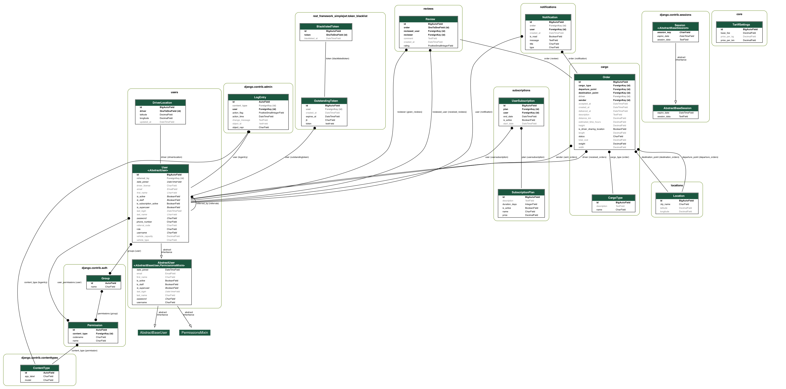

# Tracking Desk — мультиплатформенная логистическая платформа

> **Проект:** Логистическая платформа «Tracking Desk»  
> **Версия ТЗ:** 1.0  
> **Дата:** 01.10.2025

## 📘 1. Введение

### 1.1 Назначение документа
Документ фиксирует полный перечень функциональных, технических и нефункциональных требований к разработке мультиплатформенной логистической платформы, соединяющей грузоотправителей и перевозчиков.

### 1.2 Цели проекта
- Создать удобный и безопасный маркетплейс для поиска и исполнения грузоперевозок.  
- Автоматизировать расчёт стоимости, размещение заказов, уведомления и оплату.  
- Внедрить систему подписок для водителей и программу лояльности для удержания пользователей.

## ⚙️ 2. Общие (нефункциональные) требования

### 2.1 Платформы и технологии
- **Мобильные приложения:** iOS и Android (Flutter).  
- **Веб (Frontend):** SPA на Angular/Vue/React.  
- **Backend:** Python (FastAPI или Django REST Framework).  
- **База данных:** PostgreSQL.  
- **Инфраструктура:** Docker-развёртывание на VPS/облаке.

### 2.2 Производительность
- Высокая скорость загрузки интерфейсов, особенно каталога заказов.  
- 95 % API-запросов — отклик ≤ 200 мс.

### 2.3 Безопасность
- Обязательное SSL/TLS-шифрование.  
- Надёжная аутентификация и авторизация.  
- Защита от SQL-инъекций, XSS, CSRF.  
- Наличие WAF и защита от DDoS.

### 2.4 UX/UI
- Интуитивный современный интерфейс.  
- Простые формы создания заявок и оплат.  
- Сохранение фирменного стиля с улучшениями.

### 2.5 Надёжность и отказоустойчивость
- Устойчивость к сбоям.  
- Ежедневные резервные копии с быстрым восстановлением.

### 2.6 Масштабируемость
- Лёгкое подключение новых модулей и интеграций.  
- Горизонтальное масштабирование backend-а.

### 2.7 Локализация
- Поддержка 4 языков интерфейса: RU, KZ, EN, CN.

## 🧭 3. Функциональные требования

### 3.1 Роли пользователей

#### 3.1.1 Водитель/Логист
- Push-уведомления о новых заказах и подписке.  
- Просмотр и приём заказов с деталями.  
- Работа только при активной подписке.  
- Отзывы об отправителе после доставки.  
- Реферальная ссылка и история заказов.

#### 3.1.2 Отправитель
- Создание заказа: города, параметры груза, авторасчёт расстояния/стоимости.  
- Уведомления о принятии и завершении заказа.  
- История заявок, отзывы о водителях.  
- Отслеживание текущего местоположения водителя (при шаринге).

#### 3.1.3 Администратор
- Управление пользователями и правами.  
- Модерация заказов.  
- Настройка тарифов и подписок.  
- Отчётность по заказам и оплатам.  
- Просмотр локаций водителей и аналитики.

### 3.2 Основные модули
- **Размещение заказов** — удобная форма для отправителей.  
- **Поиск/приём заказов** — фильтры и кнопка «Принять» для водителей.  
- **Калькулятор маршрутов** — интеграция с Google Maps (расстояние, время, топливо, стоимость).  
- **Система уведомлений** — push через Firebase.  
- **Платёжный модуль** — эквайринг, проверки подписок.  
- **Личные кабинеты:**  
  - Водителя — подписка, заказы, история, рефералы.  
  - Отправителя — создание заявок, статусы, история.  
- **Админ-панель** — управление заказами, пользователями, тарифами и контентом.

### 3.3 Дополнительные работы
- Исправление текущих ошибок (список городов, калькулятор, iOS-авторизация).  
- Публикация приложений в App Store и Google Play.  
- Базовая оптимизация дизайна по результатам тестов.

## 🎁 4. Система бонусов и лояльности

### 4.1 Реферальная программа
- У каждого пользователя своя реферальная ссылка.  
- 1 месяц бесплатной подписки водителю за ≥ 2 привлечённых отправителей, подтвердивших аккаунт и оплативших подписку.

### 4.2 Фиксация льготной цены
- Цена подписки, оплаченная в пробный период, закрепляется навсегда даже при общем повышении тарифов.

### 4.3 Бонусы за рейтинг
- Водителям со стабильным высоким рейтингом (например, ≥ 4.8 при 10+ заказах) автоматически начисляется бесплатный месяц подписки.

## 🛠️ 5. Техническая поддержка и гарантии
- 6 месяцев бесплатной поддержки и критических обновлений.  
- 12 месяцев гарантии на работоспособность и исправление дефектов.  
- Мониторинг 24/7 (Prometheus + Grafana + алертинг).  
- Инфраструктура: VPS c конфигурацией от 8 GB RAM / 4 vCPU.  
- Настройка домена, SSL, ежедневных бэкапов.  
- Обучение — 2‑часовой онлайн-семинар для команды заказчика по админ-панели.
